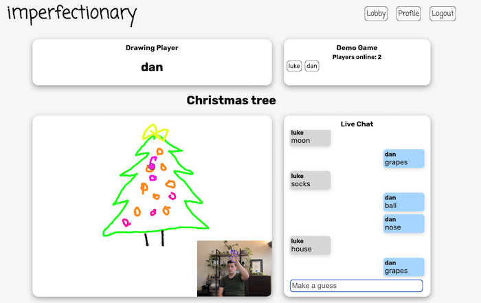
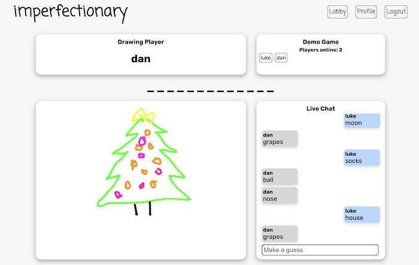

# imperfectionary

imperfectionary is a multiplayer drawing and guessing game that uses the [tensorflow.js hand pose detection](https://github.com/tensorflow/tfjs-models/tree/master/hand-pose-detection) model to track players hand positions and enables them to draw onto a canvas. 

The homepage features a drawing canvas for users to practice on before they start playing with friends.

After signing up/logging in users can create a new game room or join one that is already in progress. 

The player who created the room gets the first go at drawing while all other players try to guess. 

Guessing takes place via a live chat, when a message is detected to contain the secret word all players are notified and a new round is triggered with the correct guesser now the drawing player.      

## Check it out: [imperfectionary](https://imperfectionary.netlify.app/)

### Tech Stack:
- React
- Socket.io
- MongoDB
- Mongoose
- Node 
- Express

## How it works

The MongoDB database is modelled with mongoose and contains only a User collection. There are a small number of API endpoints for this CRUD system which are handlled by express. JWT's are used to authenticate users.

Once a user is logged in, all of the multiplayer game data is handled by a socket.io connection.

When a socket emits "enter-lobby" the server emits back a list of user defined rooms that are available to join.

A user can select from the list of rooms or create a new one. Either way results in a "join-room" emit to the server which contains the name of the room that they want to join.

The server checks if the socket is already in another user defined room and if they are it removes them before joining the new room.

The socket is then joined to the room and their username is added to the game state object keyed to that room name.

Once the socket renders the game room it emits to the server a callback function which the server runs passing in the game object for that room name and the room name itself.

When a user sends a guess it is emitted to the server which re-emits it to all other sockets in the room. It also checks if the message contains the secrect word and if it does it will trigger a "correct-guess" emit which tells all the users who guessed correctly and what the secret word was. A setTimeout function is also triggered with a 5 second delay before sending a "next-round" emit with the new game object for the room.

As the drawUser draws, their entire canvas is converted into base64 dataURL format and re emitted to all other sockets in the room to display on their canvas.

When a socket disconnects it is removed from the game that it is currently in and all the other sockets are sent an updated player list.

*Check out the [frontend repo](https://github.com/danyip/imperfectionary-fe) for more info about how tensorflow is used to draw on the canvas.* 

## Wishlist
- Add the delete route for users
- Enable users to save their "artworks" into the database